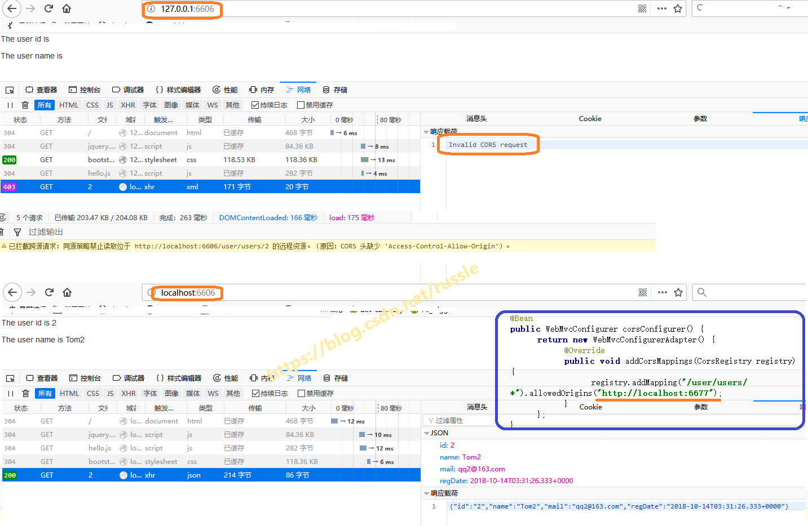

# CorsDemo

http://127.0.0.1:6606/
http://localhost:6606/swagger-ui.html#/
http://localhost:6606/

https://spring.io/guides/gs/rest-service-cors/

mvn spring-boot:run -Dserver.port=6677

CorsDemo的端口是6606， 我们在hello.js中使用"http://localhost:6606/user/users/2访问rest服务
如果我们打开应用时使用http://127.0.0.1:6606/， 系统会报跨域问题，(Invalid CORS request)
而如果我们打开应用使用http://localhost:6606， 就没有跨越问题

如果我们在rest方法上添加了@CrossOrigin(origins = "http://localhost:6677")

然后重新再启动一个java -jar target\CorsDemo-1.0-SNAPSHOT.jar   --server.port=6677，
这时候通过http://localhost:6677，可以看到rest能正常工作，但是如果我们使用http://127.0.01:6677/， 也会出现Invalid CORS request错误

如果同时设置了全局CorsRegistry和方法上的CrossOrigin吗， 那么方法上的优先，
	@Bean
	public WebMvcConfigurer corsConfigurer() {
		return new WebMvcConfigurerAdapter() {
			@Override
			public void addCorsMappings(CorsRegistry registry) {
				registry.addMapping("/user/users/*").allowedOrigins("http://localhost:6677");
			}
		};
	}
	
	
	
	记录下问题的解决办法
	容器启动成功之后，我们可以通过浏览器访问了 http://localhost:8080/index，但是我们页面上并没有看到我们期望的hell worold，却是如下的错误，这说明的我们的Controller初始化失败。。。。一脸懵逼，这是为啥？
	 @SpringBootApplication 相当于spring的三个注解的作用，但是其他注解如果想要被扫描掉，就必须和该类在同一级目录下，或者子目录下。

webjars的map路径和resource location
registry.addResourceHandler("/webjars/**")
                .addResourceLocations(
                        "classpath:/META-INF/resources/webjars/");
                        
                        
     WebMvcConfigure是用来全局定制化Spring Boot的MVC特性。如设置拦截器、跨域访问配置、格式化、URI到视图的映射或者其它全局定制接口。

效果截图：
